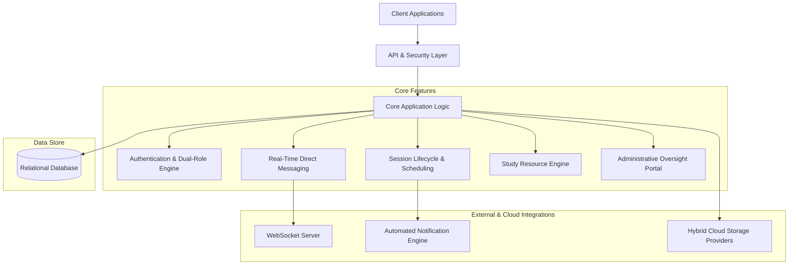
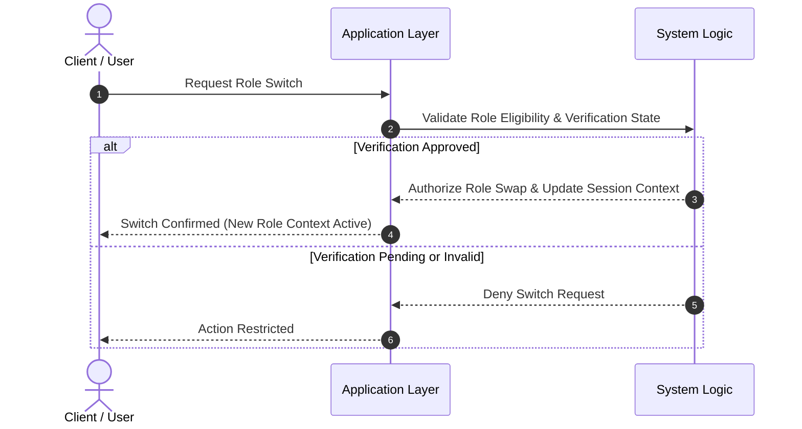
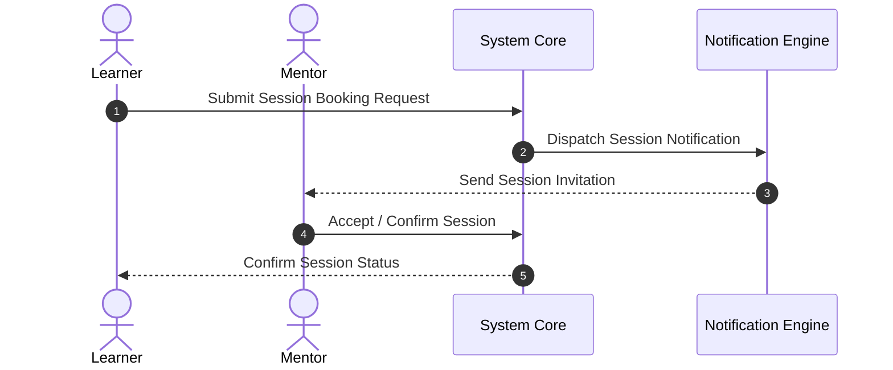

# GCCoEd — Peer Tutoring & Co-Education Management System

[](https://laravel.com)
[](https://php.net)
[](https://laravel.com/docs/sanctum)
[](https://laravel.com/docs/reverb)
[](https://cloudinary.com)
[](LICENSE)

---

## 📌 Short Repository Description (For GitHub)

> **GCCoEd** is a full-stack RESTful peer-tutoring and co-education management system built with Laravel 12. It features dual-role context switching (Learner/Mentor), verified mentor onboarding workflows, real-time WebSocket direct messaging, hybrid cloud document/media management, and automated session scheduling.

---

## 📖 Executive Summary

**GCCoEd** (Guagua Community College Co-Education System) is an enterprise-grade academic peer-tutoring platform designed to streamline collaborative learning across higher education institutions. The system bridges the gap between students seeking academic guidance (**Learners**) and qualified peer educators (**Mentors**), backed by administrative oversight (**Admins**).

Key architectural highlights include a **Dual-Role Engine** allowing seamless switching between learning and mentoring contexts without multi-account overhead, **Hybrid Cloud Storage** combining Cloudinary for dynamic avatar delivery and Google Drive API for academic document management, **Real-Time Messaging** over secure WebSocket private channels, **Automated Notification Dispatch** for session reminders and updates, and **Automated Session Lifecycles** driven by secure email action flows.

---

## 🏛️ System Architecture

GCCoEd follows a decoupled architecture built on Laravel 12, separating client requests, core application logic, real-time event broadcasting, automated notification dispatches, and external cloud integrations.



---

## 🌟 Core System Features

### 🔄 Dual-Role Engine & Context Switching
* **Single Identity Flexibility**: Users maintain a unified account capable of supporting both Learner and Mentor profiles simultaneously.
* **Dynamic Role Switching**: Authenticated users can alternate active roles on demand, dynamically updating user context, permissions, and navigation across sessions.
* **Role Verification Boundary**: Access to mentor privileges remains locked until administrator verification and approval is complete.

### 🛡️ Verified Mentor Onboarding & Approval Workflow
* **Credential Verification**: Mentor applicants submit academic proof, transcripts, and credentials during onboarding.
* **Review Queue**: Pending applications undergo administrative review before teaching capabilities are enabled.
* **Administrative Decision Engine**: Admins evaluate submissions and issue approval or rejection notices with automated email updates.

### 🎯 Peer Discovery & Subject Matching
* **Targeted Mentor Search**: Learners browse verified peer mentors filtered by subject area, academic year level, teaching style, and proficiency rating.
* **Modality & Duration Filtering**: Supports session filtering by preferred modality (*Online, In-person, Hybrid*) and session duration preferences (1 to 3 hours).

### 🗓️ Peer Session Lifecycle & Scheduling
* **Tutoring Session Requests**: Learners initiate session requests specifying target subjects, dates, and meeting locations.
* **Direct Session Offers**: Mentors can initiate direct tutoring offers to learners.
* **Action Confirmations**: Session updates, rescheduling requests, and cancellations trigger automated notifications and one-click confirmations.

### 📩 Automated Notification Engine
* **Advance Session Reminders**: System automatically scans for upcoming sessions within a 3-day window and dispatches tailored notification emails to both learners and mentors.
* **Lifecycle & Security Alerts**: Automated notifications for account approvals, rejections, password resets, and session modifications.

### 💬 Real-Time Direct Messaging
* **Peer-to-Peer Communication**: Built-in messaging system enabling direct communication between participants.
* **Private Event Broadcasting**: WebSocket channels restrict messaging access exclusively to authorized session participants.
* **Chat History**: Persistent conversation logs accessible across user sessions.

### 📚 Study Resource & Document Sharing
* **Academic Resource Hub**: Mentors upload course materials, study guides, and reference documents.
* **Secure Preview & Download**: Learners can search, preview, and download shared academic resources.

### ☁️ Hybrid Cloud Media & Document Management
* **Dynamic Profile Media**: Integrated media service handles profile avatars and scalable image delivery via Cloudinary.
* **Cloud Document Management**: Academic materials, credentials, and resources are handled via dedicated cloud storage integration.

### ⭐ Feedback, Rating & Quality Control
* **Session Ratings & Reviews**: Learners evaluate completed tutoring sessions via rating scores (1 to 5 stars) and qualitative feedback.
* **Mentor Performance Index**: Average ratings automatically update upon feedback submission to maintain educational quality.

### 📊 Administrative Analytics & Command Portal
* **System Demographics**: High-level tracking of active users, learner/mentor ratios, pending applicant queues, and course distribution metrics.
* **User Management**: Capabilities to inspect user details, manage verification queues, and maintain community guidelines.

---

## 🔄 Process Workflows

### 1. Dual-Role Context Switching Flow



### 2. Session Scheduling Workflow



---

## 🔒 Security & System Defense Principles

GCCoEd incorporates standard defensive patterns and security principles to safeguard user data and maintain service availability:

* **Token-Based Authentication & Session Hygiene**: Secured via standard API token mechanisms, ensuring credentials are verified per request and invalid session tokens are revoked upon state changes.
* **Role-Based Access Control (RBAC)**: Enforces privilege boundaries across learner, mentor, and admin contexts to prevent unauthorized operation execution.
* **Rate Limiting & Abuse Prevention**: Critical entry points incorporate rate-limiting strategies to defend against automated brute-force attacks and abuse.
* **Secure Link Verification**: Action links distributed via notifications utilize cryptographic signatures to verify link authenticity and prevent parameter tampering.
* **Input Validation & Payload Handling**: Incoming data and file uploads are checked for valid structure, type constraints, and size limits to maintain system stability.
* **Data Consistency Boundaries**: Multi-step business processes utilize transactional execution to preserve relational data consistency.

---

## 🛠️ Technology Stack

| Layer | Technology |
| :--- | :--- |
| **Backend Core** | Laravel 12 / PHP 8.2+ |
| **Authentication** | Laravel Sanctum |
| **Database** | Relational Database (SQLite / MySQL) |
| **Real-Time Communication** | WebSockets (Laravel Reverb / Pusher) |
| **Cloud Storage** | Cloudinary / Google Drive API |
| **Asset Pipeline** | Vite |

---

## ⚡ Local Development Setup

### Prerequisites
* **PHP**: `>= 8.2`
* **Composer**: `>= 2.x`
* **Node.js**: `>= 18.x` & `npm`

### Setup Instructions

1. **Clone the Repository**
   ```bash
   git clone https://github.com/SioPauwiii/GCCoEd.git
   cd GCCoEd
   ```

2. **Install Dependencies**
   ```bash
   composer install
   npm install
   ```

3. **Environment Setup**
   ```bash
   cp .env.example .env
   php artisan key:generate
   ```

4. **Database Setup**
   ```bash
   touch database/database.sqlite
   php artisan migrate
   ```

5. **Run Development Server**
   ```bash
   composer dev
   # OR
   npm run dev
   ```

---

## 📜 License

This project is open-sourced under the [MIT License](LICENSE).
